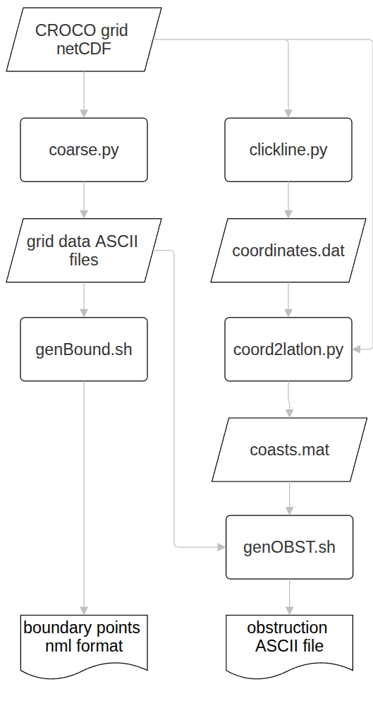

# WW3-tools

by Justino Martinez (justino@icm.csic.es)

These tools are intended to be used with TUTORIAL_GRIDGEN that can be downloaded from

ftp://ftp.ifremer.fr/ifremer/ww3/COURS/WAVES_SHORT_COURSE/TUTORIALS/TUTORIAL_GRIDGEN

additional bathymetries in

ftp://ftp.ifremer.fr/ifremer/ww3/COURS/WAVE_DATA/BATHY

General scheme of execution of this tools:

An additional tool named oasisCalm.py has added to create restart calm conditions for OASIS coupler.
